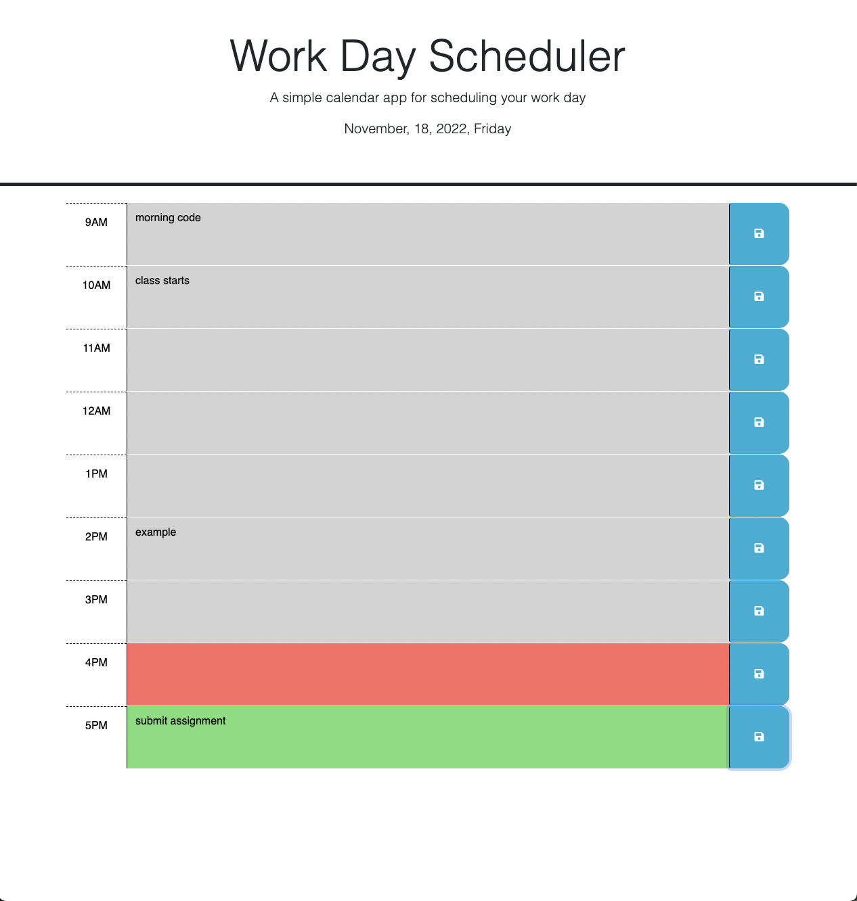

# jQuery Scheduler

## Description

This is a interactive website constructed from HTML, CSS, JS, and jQuery. Upon first glance, the interface offers interactive, saveable event slots while displaying the current date at the header. Also, to make it easier on the eyes, the event slots are automatically color coded to indicate the past, present, and future.

## Installation

N/A

## Usage

Link:

## Credits

N/A

## License

See License in repo.